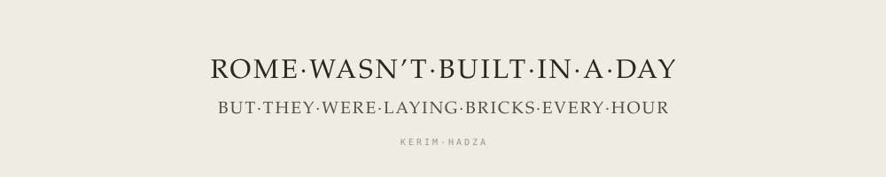

<picture>
  <source media="(prefers-color-scheme: dark)" srcset="banner-dark.svg">
  
</picture>

<table>
<tr>
<td>

<picture>
  <source media="(prefers-color-scheme: dark)" srcset="seal-dark.svg">
  
</picture>

</td>
<td>

```text
kerim@hadza

whoami ..... someone who starts things
             before knowing how they work

born ....... 2006
speaks ..... de · en · es
builds ..... hardware, apps, databases,
             houses in 3D

interests .. food · cities · people
```

</td>
</tr>
</table>

### Things I've built

**A sleeve that reads muscles** — electrodes, an amplifier, an ESP32, and a lot of noise I didn't understand at first.

**A system that plans my days** — iOS app, own database, a few agents arguing about my calendar.

**A wardrobe, in SQL** — 240 pieces, photographed in honest colours.

**Lectures, turned into flashcards** — audio in, structured notes out.

**Houses** — I modelled my family's home in 3D before I knew the word CAD.

### Elsewhere

[LinkedIn](https://www.linkedin.com/in/kerim-hadza/)
